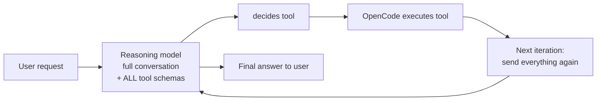
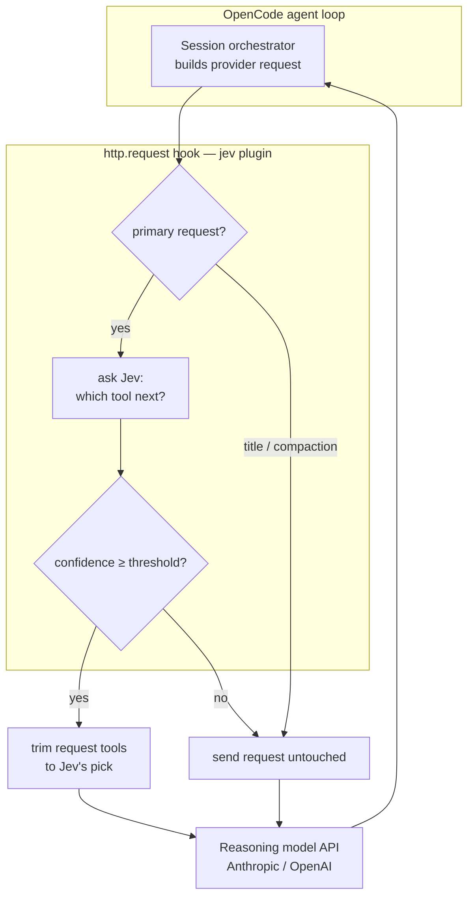
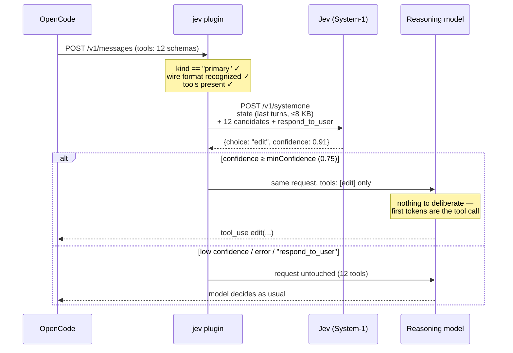

# How jev works — inside the agentic loop

What this plugin does, where it sits in OpenCode's agentic loop, and why that
saves tokens, money, and latency. Code-level details (invariants, testing)
live in [DEVELOPMENT.md](./DEVELOPMENT.md); this document explains the idea.

## 1. The agentic loop, without the plugin

An OpenCode session with a reasoning model is a loop. Every iteration, the
whole conversation plus **every tool schema** is re-sent to the provider, and
the expensive model spends its reasoning budget on two very different jobs:

1. **"Which tool should I call next?"** — a routing decision among a dozen
   candidates (`bash`, `read`, `edit`, `grep`, MCP tools, …).
2. **"How do I do the actual work?"** — the part you're paying for.

Job 1 is repeated **every iteration**, billed at premium model prices, and its
"thinking" output is pure overhead: the model weighing `read` vs `grep` is not
writing code. Meanwhile the tool schemas themselves — often thousands of
tokens per request — are re-transmitted on every turn whether or not nine of
ten candidates get ignored.

## 2. Where jev sits

The plugin registers one OpenCode V2 session hook, `http.request`, which
fires on every outbound inference request **between the OpenCode orchestrator
and the provider API**. That's the chokepoint where the tool list is still a
plain JSON array the plugin can rewrite.

Jev is TypeSafe's **System-1** model: a cheap, fast, *calibrated* model whose
only job is answering "which of these options comes next, and how sure am I?"
Think of it as a router in front of the reasoner — Kahneman's fast,
instinctive system doing the tooling reflex so the slow, deliberate system
never has to think about tooling.

## 3. One iteration, step by step

Concretely, for each eligible request the plugin:

1. **Reads** the outbound JSON body (Anthropic Messages, OpenAI Chat
   Completions, or OpenAI Responses — matched by URL path, so any compatible
   gateway works).
2. **Extracts state**: the first user message plus the last few turns, budget
   capped (≤ 8 KB), so Jev sees what the agent is mid-way through.
3. **Asks Jev** one multiple-choice question — *"Which tool should the coding
   agent execute next?"* — with the request's own tool names as options, plus
   a `respond_to_user` escape option.
4. **Acts on the answer**:
   - Confident (`confidence ≥ minConfidence`) → rewrite `payload.tools` to
     contain **only** Jev's pick. The provider literally cannot call anything
     else; the reasoning model executes the tool directly.
   - Unsure, `respond_to_user`, unavailable, or any error → change **nothing**.

`tool_choice` is left exactly as OpenCode sent it. The plugin only ever
shrinks the candidate set — never forces.

## 4. Why this saves money

Three independent savings, per trimmed request:

| Saving | Mechanism |
| --- | --- |
| **Input: tool schemas** | 12 tool schemas → 1. Typical tool schema is 100–500 tokens; dropping eleven can cut thousands of input tokens from *every* iteration of a long tool-heavy session. |
| **Output: routing deliberation** | With one candidate, the model stops emitting thinking/text weighing tool options. Premium output tokens are the most expensive kind — those go to the actual work (code, edits, arguments). |
| **What it costs instead** | One Jev round-trip: a small state blob (≤ 8 KB) + a choice answer, on a cheap System-1 model. Priced at a fraction of the reasoning model's input+deliberation it replaces. |

The math is asymmetric by design: the Jev call is paid **once per iteration**
and either saves the schema + deliberation cost of that iteration (apply) or
costs a small lookup while the request proceeds normally (bypass). A session
with N tool iterations and T tool schemas saves roughly `(N_applied) ×
(sum of dropped schema tokens) + routing reasoning tokens`, against `N ×
(one cheap Jev call)`.

## 5. Why this is faster

- **Big-model time-to-tool-call drops.** Deciding among 12 tools in thinking
  mode can mean seconds of prefill + reasoning tokens before the tool call
  starts streaming. With one tool offered, the model's first output is the
  call itself.
- **Smaller request = faster prefill.** Fewer input tokens means less
  prefill work at the provider, every iteration.
- **The Jev round-trip is the only added latency** — and it's bounded:
  `timeoutMs` caps it (env `JEV_TIMEOUT_MS` fallback; default 2000 ms worst
  case), and a Jev miss
  (timeout/error/low confidence) costs at most that one round-trip, never a
  retry storm.
- **After a bad API key (401/403) the plugin latches off** — zero added
  latency for the rest of the process, requests pass straight through.

## 6. Why trim instead of pin

The obvious design — set `tool_choice` to Jev's pick — fails in practice:
providers **reject forced `tool_choice` in thinking mode** (HTTP 400,
verified against live APIs). A `tools` array with a single entry, on the
other hand, is always valid on every supported wire format and achieves the
same effect: the model can only call that tool. Trimming also gets the
schema-token savings for free, which pinning never would.

## 7. When jev deliberately stays out of the way

The routing model is allowed to be wrong *only in ways that can't break a
session*. The request is sent untouched when:

- Jev's confidence is below `minConfidence` (default **0.75**)
- Jev picks `respond_to_user` (never strips all tools on a cheap model's word)
- Jev's pick isn't in this request's tool list
- The request already pins a tool (`tool_choice` is an object or `"none"`) or
  carries no usable tools
- Jev times out (≤ `timeoutMs`, default 2 s), errors, returns malformed
  JSON, or the key is invalid
- The traffic isn't the agent loop (`event.kind !== "primary"` — title
  generation, compaction)
- The body doesn't parse, or the URL matches no known wire format

Every decision ends in one log line — `apply:` or `bypass:` — in
`/tmp/opencode-jev.log`. See [Reading the decision log](./DEVELOPMENT.md#reading-the-decision-log).

## 8. Tuning the trust dial

`minConfidence` (config or `JEV_MIN_CONFIDENCE`) is the cost/risk knob:

| Value | Effect |
| --- | --- |
| **Lower (e.g. 0.6)** | More requests trimmed → more savings, more chances Jev's pick is the wrong tool and the session wastes one iteration on it. |
| **Higher (e.g. 0.9)** | Fewer trims, closer to plugin-less behavior. |
| **0.75 (default)** | Jev's calibration means most clearly-routed turns (sequential tool chains, obvious next steps) trim; genuinely ambiguous turns defer to the reasoning model. |

The failure mode of a wrong-but-confident trim is mild: the reasoning model
executes the offered tool, sees the result, and the *next* iteration is
re-routed. It cannot crash, refuse, or hallucinate outside its offered tool.
